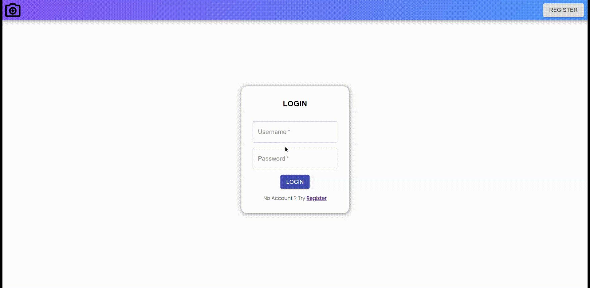
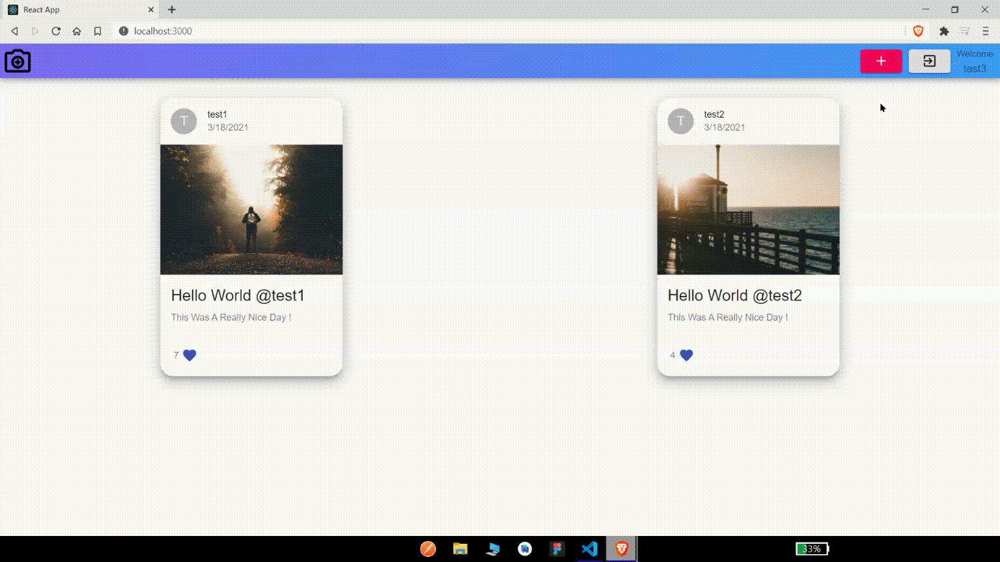
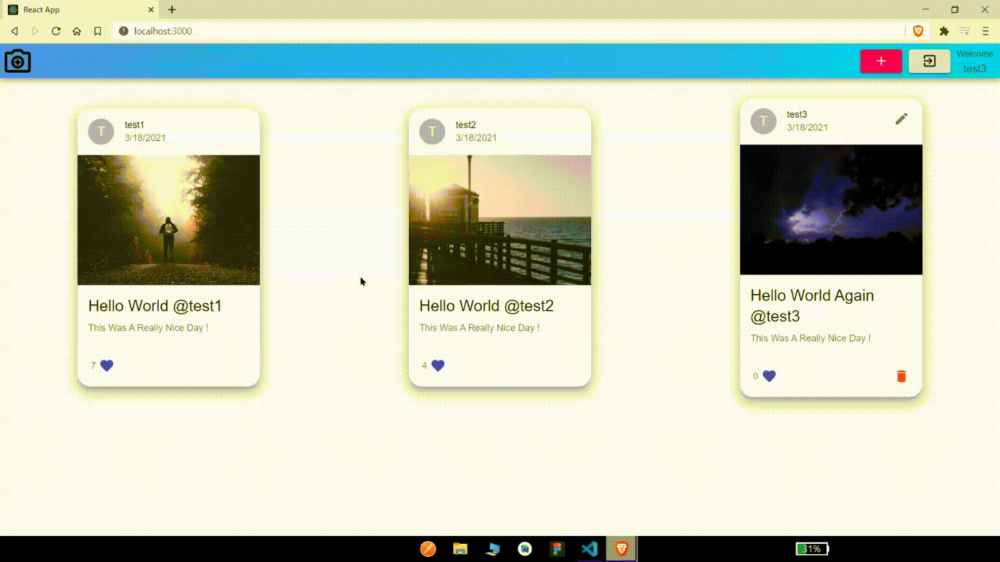
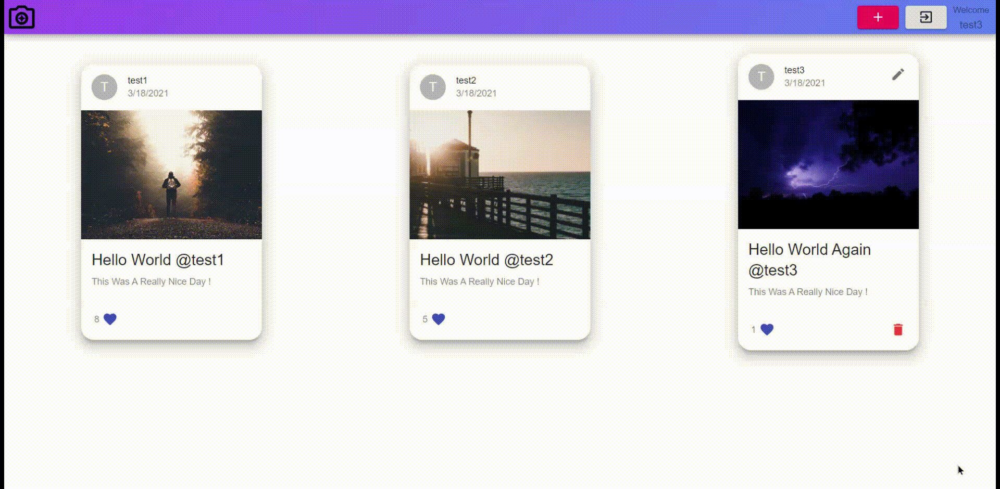
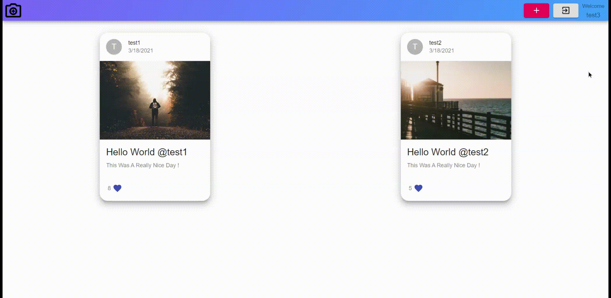

# 🎞📸 `Snap-Shots` 📸🎞 

🌈🌍 **_A Fullstack MERN Application_**

## Description

**A TypeScript MERN Application that lets users Create,Manage Snapshots of Beautiful,Unforgettable Memories.**

# 🛠 Tools Used 🔧

- 🖋 Primary Language ➡ TypeScript 🔥
- 💻 Front-End ➡ React,Material UI
- 🔧 Back-End ➡ Node,Express
- 🛢 Database ➡ MongoDB

# Getting Started

## Dependencies

✔ **Make Sure Node is installed on your machine**

## Installing

- Clone Repository ↩
- cd server ➡ npm install
- cd client ➡ npm install

## Executing program

- Add valid mongoDB config in index.ts

## Run whole Application

## cd server ➡

```
npm run start
```

## Start Server

## cd server ➡

```
npm run server
```

## Start Client

## cd client ➡

```
npm run start
```

## `Registration`


## `Login`



## `Creating Snapshots`



## `Editing Snapshots`


## `Liking Snapshots`



## `Deleting Snapshots`



## `Logout`



## Authors

Pranay Jadhav :) 🤟

## Acknowledgments

Inspiration 💪

- [project_mern_memories](https://github.com/adrianhajdin/project_mern_memories)
